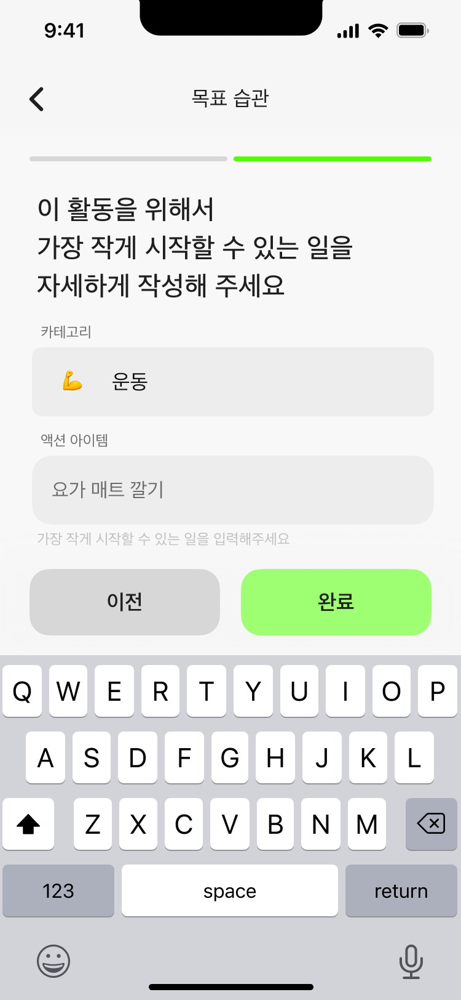
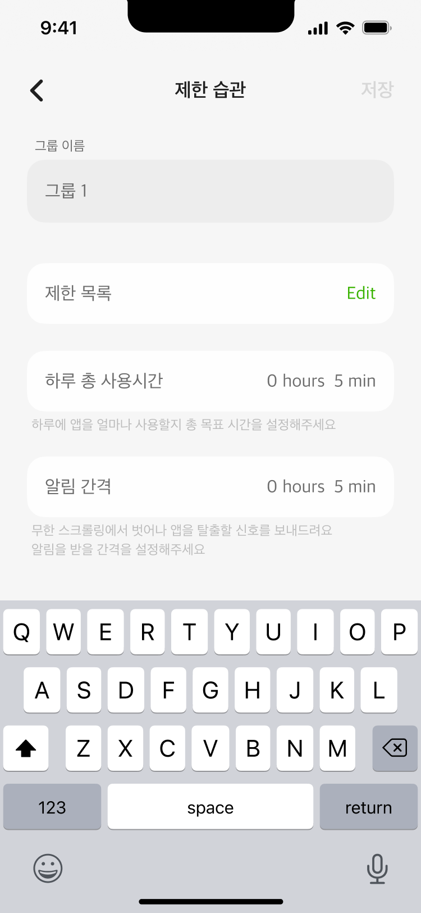
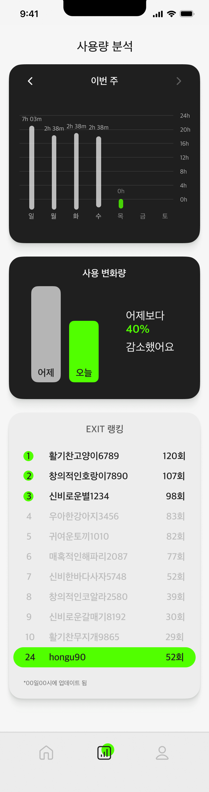
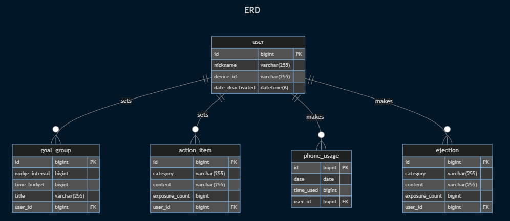
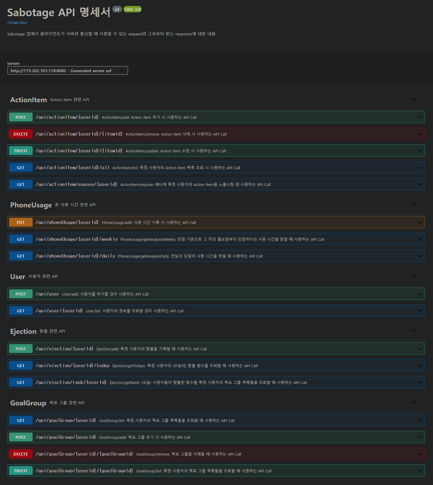

<p align="center">
    
    
</p>


# `EXIT`/server (구 `Sabotage`)
“스마트폰 이용 시간을 유익하게 변화시킬 수 있는 스크린타임 서비스” - `EXIT`의 서버 쪽 `repository`

## 주요 기능
<table>
    <tr>
        <td align="center"></td>
        <td align="center"></td>
        <td align="center"> <br></td>
    </tr>
    <tr>
        <td align="center">목표 습관 작성</td>
        <td align="center">제한 그룹 작성</td>
        <td align="center">스크린타임 시간 분석</td>
    </tr>
</table><br>

---
---

# 코드 외부

## 서버 개발 구성원
| 유채우 |
| :---: |
|  |
| [turbstructor](https://github.com/turbstructor) |

## 개발 환경
    <br>
  <br>
  <br>
   

| 구분 | 사용한 환경 |
| --- | --- |
| IDE | `Visual Studio Code` |
| Build Tool / Version | `Gradle` 8.5 |
| `java -version` | 17.0.9 |
| `Spring Boot` Version | 3.2.1 |
| Database | `MariaDB` 11.2.2 |
| API Test | `Swagger`, `Postman` |
| 서버 배포 | 개인 컴퓨터(`Archlinux` w/ `linux-zen`) |

---

# 코드 내부

## ERD


## API Docs


## Package Structure
계층 중심 패키지 구조
```
main
├── java
│   └── club
│       └── pard
│           └── server
│               └── soonjji
│                   └── sabotage
│                       ├── configuration
│                       ├── controller
│                       │   ├── actionitem
│                       │   ├── ejection
│                       │   ├── goalgroup
│                       │   ├── phoneusage
│                       │   └── user
│                       ├── converter
│                       ├── dto
│                       │   ├── request
│                       │   │   ├── actionitem
│                       │   │   ├── appusage
│                       │   │   ├── goalgroup
│                       │   │   ├── phoneusage
│                       │   │   └── user
│                       │   └── response
│                       │       ├── actionitem
│                       │       ├── ejection
│                       │       ├── goalgroup
│                       │       ├── phoneusage
│                       │       └── user
│                       ├── entity
│                       │   ├── actionitem
│                       │   ├── ejection
│                       │   ├── goalgroup
│                       │   ├── phoneusage
│                       │   └── user
│                       ├── exception
│                       ├── repository
│                       │   ├── actionitem
│                       │   ├── ejection
│                       │   ├── goalgroup
│                       │   ├── phoneusage
│                       │   └── user
│                       └── service
│                           ├── actionitem
│                           ├── ejection
│                           ├── goalgroup
│                           ├── phoneusage
│                           └── user
```

## Misc
### (시도한) Branch Strategy
`git-flow` branch strategy (reference from [git-flow cheatsheet](https://danielkummer.github.io/git-flow-cheatsheet/))

### (시도한) Commit Convention
[Conventional Commits](https://www.conventionalcommits.org/en/v1.0.0/#summary)와 [Angular / Commit Message Guidelines](https://github.com/angular/angular/blob/22b96b9/CONTRIBUTING.md#-commit-message-guidelines)를 참고하여 commit을 시도하였습니다.